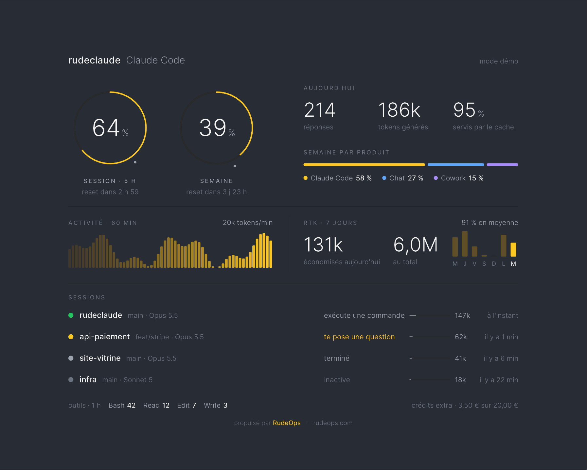
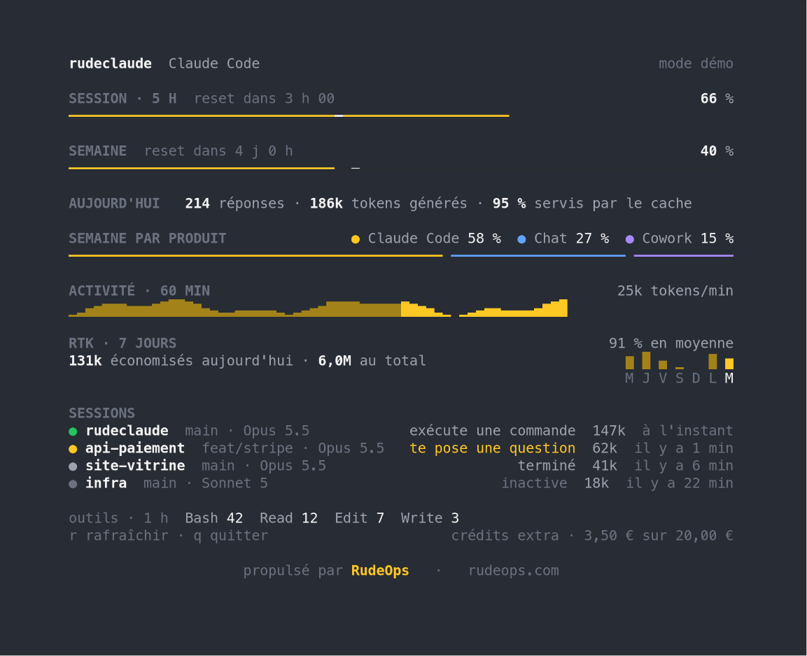

# rudeclaude

[Français](README.md) · **English**

**A tool powered by [RudeOps](https://www.rudeops.com), the newsletter
about tech in general and DevOps in particular.**



**Claude Code works. rudeclaude keeps count.**

A minimalist TUI dashboard, to know where I stand on my subscription before
Claude Code tells me itself in the middle of a refactor. Usage limits, today's
activity, and what Claude is doing in each session, while I look elsewhere.

> **Unofficial project.** rudeclaude is neither affiliated with nor endorsed
> by Anthropic. "Claude" and "Claude Code" are trademarks of Anthropic.

## What it shows

- **Limits**: the percentage used in the 5-hour window and in the week, and
  the time left before each reset. The ring turns from yellow to orange at
  70 %, then red at 90 %. The small dot shows how much of the window has
  elapsed: if the arc gets ahead of it, I'm burning faster than time passes.
  Bad sign.
- **Today**: the number of Claude replies, the tokens generated and the share
  of input tokens served from the cache.
- **Week by product**: how much of the week went into Claude Code, chat and
  Cowork. So you finally know who ate the quota.
- **Activity**: tokens generated minute by minute over the last hour. Handy
  for finding the exact moment everything went sideways.
- **RTK**: if [rtk](https://github.com/rtk-ai/rtk) is installed, the tokens it
  saved today and in total, its average rate and a histogram of the last
  7 days. Without rtk, the block disappears and activity takes the full width.
  No pressure.
- **Sessions**: each session active in the last hour, with its project, git
  branch, model, context size and what Claude is doing:
  - green: it's working ("exécute une commande", running a command;
    "modifie un fichier", editing a file…);
  - yellow: it asked you a question and is waiting for your answer. It's
    patient, at least;
  - grey: it's done, or the session is asleep.
- Most used **tools** in the last hour, and **extra credits** spent this month.
  That one, I watch through my fingers.

## Requirements

- **Linux.** macOS isn't supported yet: Claude Code keeps its credentials in
  the Keychain there, and rudeclaude doesn't know how to open it yet.
- **Claude Code**, signed in with a Claude subscription (Pro or Max).
- **Go 1.27** or newer, to build.
- A 24-bit color terminal. For image rendering, a terminal that speaks the
  [kitty graphics protocol](https://sw.kovidgoyal.net/kitty/graphics-protocol/)
  (Ghostty, kitty, WezTerm, Konsole…).
- Optionally, [rtk](https://github.com/rtk-ai/rtk) in your `PATH`, for the RTK
  block.

## Installation

```sh
go install github.com/rudeops/rudeclaude@latest
```

Or from source:

```sh
git clone https://github.com/rudeops/rudeclaude.git
cd rudeclaude
go build -o rudeclaude .
```

## Usage

```sh
rudeclaude
```

That's it. Well, almost:

| Option | Effect |
|---|---|
| `--interval 2m` | delay between two calls to the usage API (1 min by default, 30 s minimum) |
| `--render auto\|image\|text` | forces the rendering (detected automatically by default) |
| `--demo` | fake data, no network call and no log reading |
| `--snapshot file.png` | exports an image of the dashboard, then exits |
| `--version` | prints the version, then exits |

Keys: `r` to refresh, `q` to quit. There is no third one.

### Rendering

- **Images**: in compatible terminals, the dashboard is drawn as real,
  smooth images (Inter font), on a transparent background. Yes, in a
  terminal.
- **Text**: everywhere else, tmux included, the same view in characters.
  Same truth, fewer pixels.



## Privacy and security

I don't like tools that rummage through my folders without warning. So here
is exactly what rudeclaude reads in `~/.claude` (or in `$CLAUDE_CONFIG_DIR`),
and nothing else:

1. **`.credentials.json`**, for the usage limits. Claude Code's OAuth token
   is read on each call and sent **only** to `api.anthropic.com`. It is never
   displayed, copied or refreshed: if it has expired, run `claude` again.
2. **`projects/**/*.jsonl`**, Claude Code's logs, for activity and sessions.
   Only metadata is used: timestamp, project, branch, model, token counters
   and tool names. Conversation content is never interpreted, stored or
   transmitted. Your prompts don't interest it.

If rtk is installed, rudeclaude also runs `rtk gain --daily --format json`
every 30 seconds. Its numbers stay on your machine.

The last usage API response is cached in `~/.cache/rudeclaude/usage.json`
(without the token), so that several open windows don't call the API more
than once a minute in total. Open ten if it makes you feel better.

Careful: the `--snapshot` export shows the names of your projects and
branches. Double-check before sharing a screenshot with
`hotfix/montargis-panique` lying around.

## Known limitations

- The usage API (`/api/oauth/usage`) is **not documented** by Anthropic and
  may change or disappear without notice. If rudeclaude breaks one morning
  for no reason, it's probably that.
- Only Claude Code activity on the local machine is visible. Conversations on
  claude.ai or in the desktop app count towards the limits (and the week by
  product), but not towards activity. If the percentage climbs while activity
  doesn't move, that's you, on your phone.
- A pending permission request (before running a command) leaves no trace in
  the logs: the session stays displayed as "exécute une commande", with the
  elapsed time after 2 minutes. If it drags on, go have a look: it's probably
  waiting for your go-ahead.
- rtk splits its days in UTC: right after midnight, its "today" is still a
  bit of yesterday.
- The interface is in French. I don't intend to apologize for it, but other
  languages may come in future versions.

## Code layout

```
main.go                 options and choice of rendering
internal/usage/         usage API call, token, shared cache
internal/activity/      session tracking in Claude Code's logs
internal/rtk/           rtk token savings, if installed
internal/gfx/           image drawing of the overview, Inter font
internal/kitty/         kitty graphics protocol
internal/ui/            image mode loop, text fallback (Bubble Tea)
internal/theme/         text mode colors
```

Run the tests with `go test ./...`.

## The RudeOps newsletter

rudeclaude was born in the workshop of [RudeOps](https://www.rudeops.com), an
independent tech and DevOps newsletter, written in French, for those who keep
systems running in production.

On the site, besides the newsletter: [guides](https://www.rudeops.com/guides)
(DevOps, the CAMS model, the three ways…), a
[tech glossary](https://www.rudeops.com/rudefinitions) and quizzes to prepare
for the Kubernetes KCNA and KCSA certifications.

**→ [Subscribe on rudeops.com](https://www.rudeops.com)** ·
[Archives](https://www.rudeops.com/newsletters) ·
[RSS](https://www.rudeops.com/feed.xml)

## License

[GPL v3](LICENSE). The [Inter](https://rsms.me/inter/) font is included under
the [OFL](internal/gfx/fonts/LICENSE.txt).
